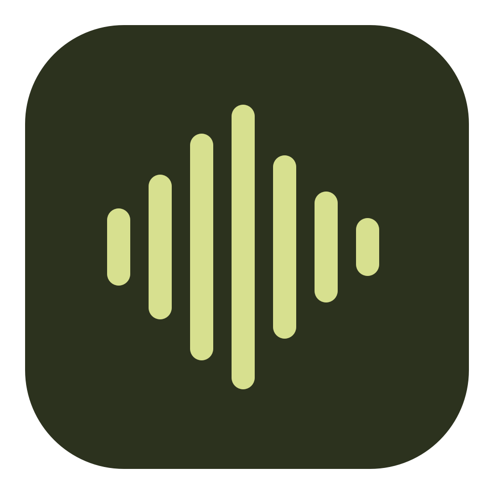
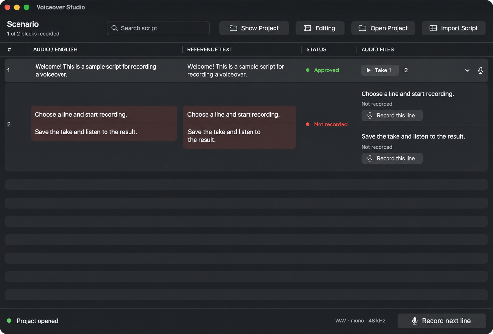

<p align="center"></p>
<h1 align="center">Voiceover Studio</h1>
<p align="center">Graba tu guion línea por línea. Quédate con la toma que te guste.</p>
<p align="center"><a href="https://github.com/Odweike/voiceover-studio/releases/download/v0.4.0/Voiceover-Studio-0.4.0-universal.dmg"><strong>Descargar para macOS</strong></a> · <a href="https://playrito.site/voiceOver/">Sitio web</a> · <a href="README.md">English</a> · <a href="README.ru.md">Русский</a> · <a href="README.fr.md">Français</a></p>

Una pequeña app nativa de macOS para grabar locuciones a partir de un guion. Importa tu texto, graba líneas individuales, compara las tomas y lleva los archivos WAV seleccionados a tu editor de vídeo.

La hice para mi propio flujo de trabajo de locución y decidí compartirla. Es gratuita, funciona sin conexión y no requiere cuenta.



*La interfaz está disponible en inglés, español, francés y ruso — elígela en los Ajustes de la app.*

## Descargar e instalar

**[Descargar Voiceover Studio 0.4.0 — DMG universal](https://github.com/Odweike/voiceover-studio/releases/download/v0.4.0/Voiceover-Studio-0.4.0-universal.dmg)**

Requiere **macOS 14.4 o posterior**. Incluye binarios para Apple Silicon e Intel. La app se ha probado en Apple Silicon; esta versión aún no se ha probado en un Mac Intel físico. La interfaz sigue el idioma de tu Mac (inglés, español, francés o ruso) y se puede cambiar en los Ajustes de la app.

1. Abre el DMG y arrastra **Voiceover Studio** a **Aplicaciones**.
2. Expulsa el DMG y abre la app desde Aplicaciones.
3. Permite el acceso al micrófono la primera vez que grabes.

**Nota sobre el primer inicio:** esta versión independiente usa una firma ad-hoc y **no está notarizada por Apple**. macOS puede bloquearla. Si confías en la descarga, tras intentar abrirla, ve a **Ajustes del Sistema → Privacidad y seguridad → Abrir de todos modos**. Consulta las [instrucciones oficiales de Apple](https://support.apple.com/102445).

Descarga desde los [Releases](https://github.com/Odweike/voiceover-studio/releases) de este repositorio. Un [archivo de suma SHA-256](https://github.com/Odweike/voiceover-studio/releases/download/v0.4.0/SHA256SUMS.txt) acompaña al DMG. No necesitas instalar Xcode, Python ni Node.js para usar la app.

## Qué hace

- **El guion junto a la grabadora.** Texto en ruso e inglés en una tabla redimensionable; usa uno o ambos idiomas.
- **Una grabación por línea.** Graba un bloque entero o divídelo con marcadores `[voice:...]`.
- **Varias tomas.** Escucha, pausa y reanuda, elige la mejor toma y mueve las demás a la Papelera.
- **Audio listo para editar.** Archivos WAV mono, 48 kHz, PCM de 24 bits.
- **Proyectos independientes.** Cada importación crea una carpeta nueva, así las grabaciones de distintos guiones no se mezclan.
- **Almacenamiento local y recuperación.** JSON y WAV normales, escritura atómica de metadatos y un diario de grabaciones pendientes.

Es una grabadora enfocada, no un editor de audio completo. No recorta ni procesa audio, no escribe de vuelta a Excel ni se sincroniza automáticamente con Premiere. Lleva los archivos WAV a tu editor preferido para ese trabajo.

## Tu primera locución

La app abre un pequeño ejemplo en el primer inicio.

1. Elige **Importar guion** para importar un archivo JSON/XLSX. Para continuar un proyecto existente, elige **Abrir proyecto** y selecciona su carpeta.
2. Pulsa **Grabar esta línea** junto a una línea y luego **Guardar**. Usa **Nueva toma** para intentarlo de nuevo.
3. Escucha y selecciona la toma que quieras conservar. La primera toma se selecciona automáticamente.
4. Pulsa **Mostrar proyecto** para abrir la carpeta con tus archivos WAV y `manifest.json`.

La importación siempre crea un proyecto **nuevo**. Para seguir trabajando en el mismo guion con sus grabaciones, vuelve a abrir su carpeta de proyecto en lugar de importarlo otra vez.

## Trae un guion

Empieza con [el JSON de ejemplo](Resources/scenario.json). Cada bloque necesita un ID, un número visible y ambos campos de idioma; uno de ellos puede estar vacío:

```json
[
  {
    "id": "intro",
    "number": "1",
    "russian": "Привет! Сегодня покажу, как это работает.",
    "english": "Hello! Today I'll show you how this works."
  }
]
```

Para XLSX, usa un libro sencillo de una sola hoja: **la fila 1 contiene los encabezados, la columna D es el texto en ruso y la columna E el texto en inglés**. Los números visibles van en la columna A. Las fórmulas no se calculan.

¿Necesitas varias grabaciones dentro de un bloque? Pon un marcador antes de cada línea:

```text
[voice:intro-greeting]
Hello!

[voice:intro-start]
Let's get started.
```

Los marcadores deben ser únicos en todo el guion. Si ambos idiomas están presentes, usa los mismos marcadores en el mismo orden. Consulta el [formato completo del guion](docs/SCRIPT_FORMAT.md) para ver las columnas opcionales y los límites de importación.

## Tus archivos son tuyos

Los proyectos se guardan en `~/Movies/Voiceover Studio/Projects/` por defecto. Cada carpeta contiene el guion, un manifest y un directorio `Recordings`. Haz copia de **toda la carpeta** para conservar la relación entre líneas, tomas y selecciones.

La app no tiene servicios de red, analíticas, cuentas ni subida a la nube. Un diario temporal ayuda a recuperar una grabación cuyos metadatos no se guardaron antes de una interrupción. Tras un fallo, revisa el audio recuperado: conservar el archivo no garantiza que un WAV interrumpido sea válido.

Los proyectos de la versión personal original se pueden abrir en su sitio. Cierra primero la app antigua. Consulta los [detalles de almacenamiento y recuperación](docs/ARCHITECTURE.md).

## Compilar desde el código fuente

Necesitas macOS 14.4+ y una toolchain de Swift 6+ (Xcode Command Line Tools para una compilación nativa; Xcode completo para el paquete universal).

```sh
git clone https://github.com/Odweike/voiceover-studio.git
cd voiceover-studio
./build.sh
open "build/Voiceover Studio.app"
```

Ejecuta el bundle `.app` en lugar de `swift run`, para que macOS pueda leer la descripción del permiso de micrófono y el ejemplo incluido.

```sh
swift test                     # pruebas de regresión
python3 tools/check.py         # valida el bundle compilado
./tools/package-dmg.sh         # app universal, DMG y suma de verificación
```

La app usa SwiftUI, AVFoundation y Foundation. **Sin dependencias de terceros en tiempo de ejecución.** [Visión general de la arquitectura](docs/ARCHITECTURE.md) · [Guía de contribución](CONTRIBUTING.md) · [Guía de releases](RELEASING.md)

## Comentarios y contribuciones

¿Encontraste un error o tienes una mejora? [Abre un issue](https://github.com/Odweike/voiceover-studio/issues). Incluye tu versión de macOS, lo que esperabas y los pasos para reproducirlo. Un guion de ejemplo anonimizado ayuda; por favor, no adjuntes grabaciones privadas.

Los pull requests pequeños y enfocados son bienvenidos. La identidad de las grabaciones, la seguridad de los archivos y un flujo de trabajo sencillo importan más que añadir capas o funciones.

## Licencia

[MIT](LICENSE). Hecha por [Maxim Marin](https://github.com/Odweike).
