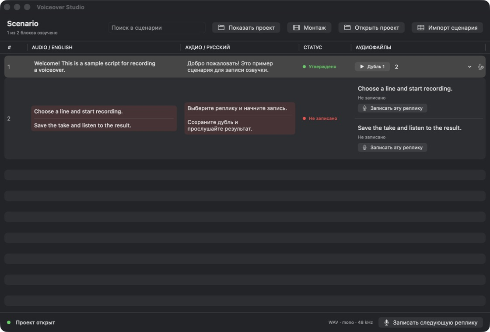

<p align="center"></p>
<h1 align="center">Voiceover Studio</h1>
<p align="center">Record your script one line at a time. Keep the take you like.</p>
<p align="center"><a href="https://github.com/Odweike/voiceover-studio/releases/download/v0.2.0/Voiceover-Studio-0.2.0-universal.dmg"><strong>Download for macOS</strong></a> · <a href="https://voiceover-studio.excomper.chatgpt.site">Website</a> · <a href="README.ru.md">Русский</a></p>

A small native macOS app for recording voiceovers from a script. Import your text, record individual lines, compare takes and bring the selected WAV files into your video editor.

I built it for my own voiceover workflow and decided to share it. It's free, works offline and doesn't require an account.



## Download and install

**[Download Voiceover Studio 0.2.0 — universal DMG](https://github.com/Odweike/voiceover-studio/releases/download/v0.2.0/Voiceover-Studio-0.2.0-universal.dmg)**

Requires **macOS 14.4 or later**. Includes Apple Silicon and Intel binaries. The app has been tested on Apple Silicon; this release has not yet been tested on a physical Intel Mac. The app interface is currently in Russian.

1. Open the DMG and drag **Voiceover Studio** into **Applications**.
2. Eject the DMG and open the app from Applications.
3. Allow microphone access when you first record.

**First-launch note:** this independent release uses an ad-hoc signature and is **not notarized by Apple**. macOS may block it. If you trust the download, after attempting to launch it, use **System Settings → Privacy & Security → Open Anyway**. See [Apple's official instructions](https://support.apple.com/102445).

Download from this repository's [Releases](https://github.com/Odweike/voiceover-studio/releases). A [SHA-256 checksum file](https://github.com/Odweike/voiceover-studio/releases/download/v0.2.0/SHA256SUMS.txt) accompanies the DMG. No need to install Xcode, Python or Node.js to use the app.

## What it does

- **Script beside the recorder.** Russian and English text in a resizable table; use one or both languages.
- **One recording per line.** Record an entire block or split it with `[voice:...]` markers.
- **Multiple takes.** Listen, pause/resume, select the best take and move unwanted ones to Trash.
- **Ready-to-edit audio.** Mono, 48 kHz, 24-bit PCM WAV files.
- **Separate projects.** Importing a script creates a new folder, so recordings from different scripts stay separate.
- **Local storage and recovery.** Plain JSON and WAV files, atomic metadata writes and a pending-recording journal.

This is a focused recorder, not a full audio editor. It doesn't trim or process audio, write back to Excel, or automatically sync with Premiere. Bring the WAV files into your preferred editor for that work.

## Your first voiceover

The app opens a small example on first launch.

1. Choose **Импорт сценария** to import a JSON/XLSX file. To continue an existing project, choose **Открыть проект** and select its folder.
2. Click **Записать эту реплику** beside a line, then **Сохранить**. Use **Новый дубль** to try again.
3. Listen and select the take you want to keep. The first take is selected automatically.
4. Click **Показать проект** to open the folder containing your WAV files and `manifest.json`.

Import always creates a **new** project. To keep working on the same script and recordings, reopen its project folder instead of importing again.

## Bring a script

Start with [the example JSON](Resources/scenario.json). Each block needs an ID, a display number, and both language fields; one language can be empty:

```json
[
  {
    "id": "intro",
    "number": "1",
    "russian": "Привет! Сегодня покажу, как это работает.",
    "english": "Hello! Today I'll show you how this works."
  }
]
```

For XLSX, use a simple single-sheet workbook: **row 1 contains headers, column D is Russian text and column E is English text**. Display numbers go in column A. Formulas are not calculated.

Need several recordings within one block? Put a marker before each line:

```text
[voice:intro-greeting]
Hello!

[voice:intro-start]
Let's get started.
```

Markers must be unique across the scenario. If both languages are present, use the same markers in the same order. See the [complete script format](docs/SCRIPT_FORMAT.md) for optional columns and import limits.

## Your files stay yours

Projects are stored in `~/Movies/Voiceover Studio/Projects/` by default. Each folder contains the scenario, a manifest and a `Recordings` directory. Back up the **whole folder** to preserve the relationship between lines, takes and selections.

The app has no network services, analytics, account or cloud upload. A temporary journal helps recover a recording whose metadata was not saved before an interruption. After a crash or device failure, inspect recovered audio: retaining a file does not guarantee that an interrupted WAV is valid.

Existing projects from the original personal version can be opened in place. Close the old app first. See [storage and recovery details](docs/ARCHITECTURE.md).

## Build from source

Use macOS 14.4+ and a Swift 6+ toolchain (Xcode Command Line Tools for a native build; full Xcode for the universal package).

```sh
git clone https://github.com/Odweike/voiceover-studio.git
cd voiceover-studio
./build.sh
open "build/Voiceover Studio.app"
```

Run the `.app` bundle rather than `swift run`, so macOS can read its microphone permission description and bundled example.

```sh
swift test                     # regression tests
python3 tools/check.py         # validate the built bundle
./tools/package-dmg.sh         # universal app, DMG and checksum
```

The app uses SwiftUI, AVFoundation and Foundation. **No third-party runtime dependencies.** [Architecture overview](docs/ARCHITECTURE.md) · [Contribution guide](CONTRIBUTING.md) · [Release guide](RELEASING.md)

## Feedback and contributions

Found a bug or have an improvement? [Open an issue](https://github.com/Odweike/voiceover-studio/issues). Include your macOS version, what you expected and the steps to reproduce it. An anonymized example script helps; please don't attach private recordings.

Small, focused pull requests are welcome. Recording identity, file safety and a straightforward workflow matter more than adding layers or features.

## License

[MIT](LICENSE). Made by [Maxim Marin](https://github.com/Odweike).
